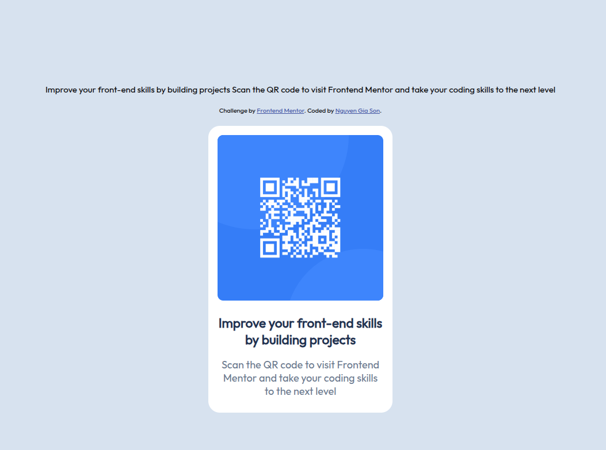

# Frontend Mentor - QR code component solution

This is a solution to the [QR code component challenge on Frontend Mentor](https://www.frontendmentor.io/challenges/qr-code-component-iux_sIO_H). Frontend Mentor challenges help you improve your coding skills by building realistic projects. 

## Table of contents

- [Overview](#overview)
  - [Screenshot](#screenshot)
  - [Links](#links)
- [My process](#my-process)
  - [Built with](#built-with)
  - [What I learned](#what-i-learned)
  - [Continued development](#continued-development)
  - [Useful resources](#useful-resources)
- [Author](#author)
- [Acknowledgments](#acknowledgments)

**Note: Delete this note and update the table of contents based on what sections you keep.**

## Overview

### Screenshot



### Links

- Solution URL: [Add solution URL here](https://github.com/MT1607/fe_mentor/tree/main/qr-code-component-main)
- Live Site URL: [Add live site URL here](https://mt1607.github.io/fe_mentor/qr-code-component-main/)

## My process

### Built with

- Semantic HTML5 markup
- CSS custom properties
- Flexbox
- CSS Grid
- Mobile-first workflow

### What I learned

Create child elements and hide overflowing content on parent or sibling elements."

To see how you can add code snippets, see below:

```html
<div class="qr-oval">
  <div class="oval-1"></div>
  <div class="oval-2"></div>
</div>
```
```css
.qr-code-wrapper  {
  overflow: hidden;
}
```

### Continued development

Allows users to add data to convert into a QR code as desired and store it.

### Useful resources

- [Chat GPT](https://chatgpt.com/) - ChatGPT helps me research and answer my questions.


## Author

- Github - [MT1607](https://github.com/MT1607)
- Frontend Mentor - [@MT1607](https://www.frontendmentor.io/profile/MT1607)